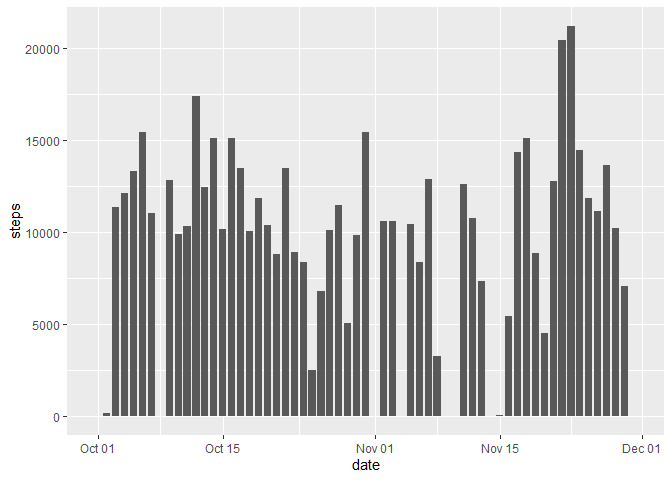
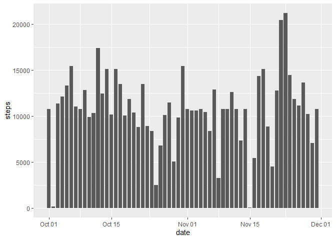

Data analysis done on data collected from a personal activity monitoring device.
his device collects data at 5 minute intervals through out the day. The data consists of two months of data from an anonymous individual collected during the months of October and November, 2012 and include the number of steps taken in 5 minute intervals each day.

I utilized the **dplyr** library for processing and the **ggplot** library to plot the data.

```r
library(dplyr)
library(ggplot2)
```


### Loading and preprocessing the data
The first step, was to **load** the data into R:


```r
activity<-read.csv("activity.csv")
```

Afterwards, I checked the class of all columns and realized the date column was incorrect. Here I changed to date class. 
This was the only preprocess I needed.

```r
class(activity$date)
```

```
## [1] "character"
```

```r
activity$date<-as.Date(activity$date,format="%Y-%m-%d")
class(activity$date)
```

```
## [1] "Date"
```


### What is mean total number of steps taken per day?

First, we were asked to calculate the total number of steps taken per day. Please note that day 1 and 8 of october its 0 since it was all missing data.

```r
by_date_sum <- activity %>% group_by(date) %>% summarize(steps=sum(steps,na.rm =TRUE))
head(by_date_sum,10)
```

```
## # A tibble: 10 x 2
##    date       steps
##    <date>     <int>
##  1 2012-10-01     0
##  2 2012-10-02   126
##  3 2012-10-03 11352
##  4 2012-10-04 12116
##  5 2012-10-05 13294
##  6 2012-10-06 15420
##  7 2012-10-07 11015
##  8 2012-10-08     0
##  9 2012-10-09 12811
## 10 2012-10-10  9900
```

And here is the sum of the steps per day plotted:


```r
g<- ggplot(by_date_sum,aes(date,steps))
g+geom_bar(stat="Identity",width=0.8)
```

<!-- -->

Finally, we were asked to calculate the mean and median of the total number of steps taken per day, which was done the same way


```r
by_date_mean <- activity %>% group_by(date) %>% summarize(steps=mean(steps,na.rm =TRUE))
head(by_date_mean,10)
```

```
## # A tibble: 10 x 2
##    date         steps
##    <date>       <dbl>
##  1 2012-10-01 NaN    
##  2 2012-10-02   0.438
##  3 2012-10-03  39.4  
##  4 2012-10-04  42.1  
##  5 2012-10-05  46.2  
##  6 2012-10-06  53.5  
##  7 2012-10-07  38.2  
##  8 2012-10-08 NaN    
##  9 2012-10-09  44.5  
## 10 2012-10-10  34.4
```

```r
by_date_median <- activity %>% group_by(date) %>% summarize(steps=median(steps,na.rm =TRUE))
head(by_date_median,10)
```

```
## # A tibble: 10 x 2
##    date       steps
##    <date>     <dbl>
##  1 2012-10-01    NA
##  2 2012-10-02     0
##  3 2012-10-03     0
##  4 2012-10-04     0
##  5 2012-10-05     0
##  6 2012-10-06     0
##  7 2012-10-07     0
##  8 2012-10-08    NA
##  9 2012-10-09     0
## 10 2012-10-10     0
```
As you can see, even though na.rm was set to True, the first day is a missing value because there was not a single recording of steps that day.
Median is mostly 0s across all days because of the overwhelming amount of 0s in the dataset.

## What is the average daily activity pattern?

Next we had to make a time series plot of the 5-minute interval and the average number of steps taken, averaged across all days.
For this, I grouped by the interval and got the average of the steps for each interval. 


```r
by_interval_mean <- activity %>% group_by(interval) %>% summarize(steps=mean(steps,na.rm =TRUE))
g<- ggplot(by_interval_mean,aes(interval,steps))
g+geom_line()
```

<!-- -->

Which 5-minute interval, on average across all the days in the dataset, contains the maximum number of steps?
The answer is interval 835 with 206 steps:

```r
by_interval_mean[which.max(by_interval_mean$steps),]
```

```
## # A tibble: 1 x 2
##   interval steps
##      <int> <dbl>
## 1      835  206.
```

## Imputing missing values
Since the data had a lot of missing values, we were first asked to calculate how many rows had missing values.
In total, there were <span style="color: red;">2304 rows</span> with missing values in the steps column.

```r
colSums(is.na(activity))
```

```
##    steps     date interval 
##     2304        0        0
```

Since I had already calculated the mean of each interval, the strategy I chose to populate the missing data was to utilize this mean for the interval that was missing its steps.
I first created a new dataframe identical to the original and then made a for loop which checks every row, if it detects a NA value, it will replace it with the calculated mean of the given interval.

```r
activity_no_NA<-activity
for(i in 1:length(activity_no_NA$steps)){
        if(is.na(activity_no_NA$steps[i])){
                activity_no_NA$steps[i]<-subset(by_interval_mean$steps,
                       by_interval_mean$interval==activity_no_NA$interval[i])
        }
}
```

You can see that the values were correctly replaced by comparing the original "activity" dataframe and the new dataframe with no NA values.

```r
head(activity)
```

```
##   steps       date interval
## 1    NA 2012-10-01        0
## 2    NA 2012-10-01        5
## 3    NA 2012-10-01       10
## 4    NA 2012-10-01       15
## 5    NA 2012-10-01       20
## 6    NA 2012-10-01       25
```

```r
head(activity_no_NA)
```

```
##       steps       date interval
## 1 1.7169811 2012-10-01        0
## 2 0.3396226 2012-10-01        5
## 3 0.1320755 2012-10-01       10
## 4 0.1509434 2012-10-01       15
## 5 0.0754717 2012-10-01       20
## 6 2.0943396 2012-10-01       25
```

I then proceeded to calculate the total steps per day of this new dataframe:

```r
by_date_sum2 <- activity_no_NA %>% group_by(date) %>% summarize(steps=sum(steps,na.rm =TRUE))
```

```
## `summarise()` ungrouping output (override with `.groups` argument)
```

And here is the plot for this new data as well as the median and mean:

```r
g<- ggplot(by_date_sum2,aes(date,steps))
g+geom_bar(stat="Identity",width=0.8)
```

<!-- -->

```r
by_date_mean2<-activity_no_NA %>% group_by(date) %>% summarize(steps=mean(steps,na.rm =TRUE))
```

```
## `summarise()` ungrouping output (override with `.groups` argument)
```

```r
head(by_date_mean2,10)
```

```
## # A tibble: 10 x 2
##    date        steps
##    <date>      <dbl>
##  1 2012-10-01 37.4  
##  2 2012-10-02  0.438
##  3 2012-10-03 39.4  
##  4 2012-10-04 42.1  
##  5 2012-10-05 46.2  
##  6 2012-10-06 53.5  
##  7 2012-10-07 38.2  
##  8 2012-10-08 37.4  
##  9 2012-10-09 44.5  
## 10 2012-10-10 34.4
```

```r
by_date_median2<-activity_no_NA %>% group_by(date) %>% summarize(steps=median(steps,na.rm =TRUE))
```

```
## `summarise()` ungrouping output (override with `.groups` argument)
```

```r
head(by_date_median2,10)
```

```
## # A tibble: 10 x 2
##    date       steps
##    <date>     <dbl>
##  1 2012-10-01  34.1
##  2 2012-10-02   0  
##  3 2012-10-03   0  
##  4 2012-10-04   0  
##  5 2012-10-05   0  
##  6 2012-10-06   0  
##  7 2012-10-07   0  
##  8 2012-10-08  34.1
##  9 2012-10-09   0  
## 10 2012-10-10   0
```

We can observe that the values differ greatly the days previously reported as NA, since we added a lot of new information. 

## Are there differences in activity patterns between weekdays and weekends?

For the next part, we had to add a new column which specified if the date given was a weekday or a weekend, I utilized the data set without NA values.

For this, I did a simple for loop which reads the output of the weekdays() function, if the output is either Saturday or Sunday, it will assign it as a weekend, otherwise a weekday. Please observe that 2012-10-01 is a Monday and its correctly categorized as weekday while 2012-10-06 is a SAturday and its categorized as weekend.


```r
for(i in 1:length(activity_no_NA$steps)){
        if(weekdays(activity_no_NA$date[i])=="Saturday"|weekdays(activity_no_NA$date[i])=="Sunday"){
                activity_no_NA$day[i]<-"weekend"
        }
        else activity_no_NA$day[i]<-"weekday"
}

weekdays(activity_no_NA[1,2])
```

```
## [1] "Monday"
```

```r
head(activity_no_NA,5)
```

```
##       steps       date interval     day
## 1 1.7169811 2012-10-01        0 weekday
## 2 0.3396226 2012-10-01        5 weekday
## 3 0.1320755 2012-10-01       10 weekday
## 4 0.1509434 2012-10-01       15 weekday
## 5 0.0754717 2012-10-01       20 weekday
```

```r
weekdays(activity_no_NA[1441,2])
```

```
## [1] "Saturday"
```

```r
activity_no_NA[1441:1445,]
```

```
##      steps       date interval     day
## 1441     0 2012-10-06        0 weekend
## 1442     0 2012-10-06        5 weekend
## 1443     0 2012-10-06       10 weekend
## 1444     0 2012-10-06       15 weekend
## 1445     0 2012-10-06       20 weekend
```

And here is the plot for the weekend and weekday average steps per interval across all dates.

```r
by_interval_mean <- activity_no_NA %>% group_by(interval,day) %>% summarize(steps=mean(steps,na.rm =TRUE))
```

```
## `summarise()` regrouping output by 'interval' (override with `.groups` argument)
```

```r
g<- ggplot(by_interval_mean,aes(interval,steps))
g+geom_line()+facet_grid(.~day)
```

<!-- -->
